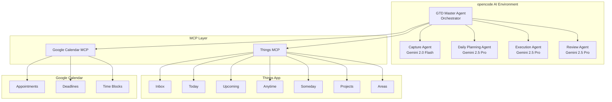
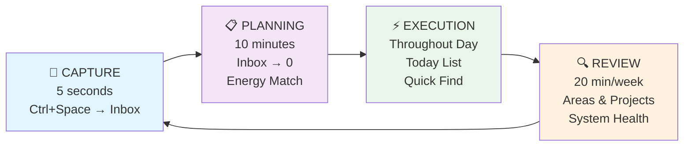
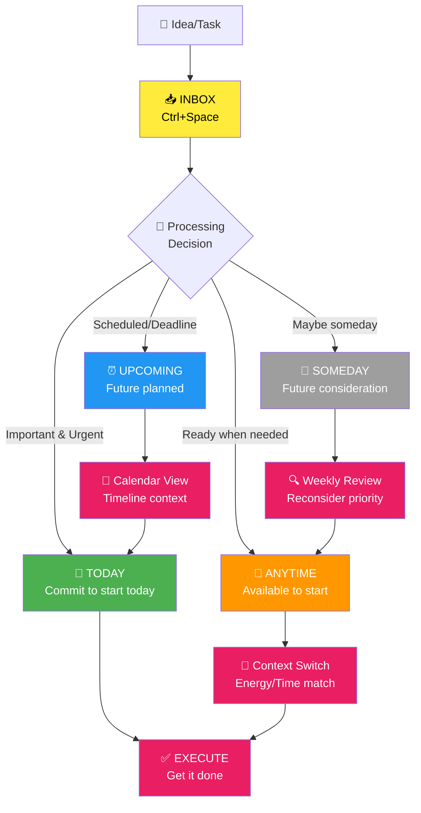

# My GTD Buddy

A Things-native Getting Things Done (GTD) workflow optimized for daily productivity. This project implements a streamlined GTD system that leverages Things' built-in strengths with intelligent AI agents to automate workflow managementhttps://github.com/realYushi/my-gtd-buddy.

## 📑 Table of Contents

-   [Overview](#-overview)
-   [Key Features](#-key-features)
-   [Intelligent Agents](#-intelligent-agents)
-   [Technology Stack](#-technology-stack)
-   [System Architecture](#️-system-architecture)
-   [GTD Workflow](#-gtd-workflow)
-   [Project Structure](#-project-structure)
- [Requirements](#-requirements)
- [Important Warning](#️-important-warning)
- [Setup Guide](#️-setup-guide)
-   [How to Use](#-how-to-use)
-   [Daily Workflow](#-daily-workflow)
-   [Customization](#-customization)
-   [Privacy Note](#-privacy-note)

## 🎯 Overview

This is my personal implementation of David Allen's GTD methodology, specifically designed around the Things app with intelligent agents to automate workflow management. **While I use Things 3, you can adapt this system to work with any todo list app** by replacing the MCP server and updating the agent instructions.

The system focuses on:

-   **Instant capture** - Everything goes to Things Inbox first (Ctrl+Space)
-   **Daily planning** - Inbox to zero using Things native Today/Upcoming/Anytime/Someday
-   **Focused execution** - Today/Anytime focus with Quick Find context switching
-   **Weekly reviews** - Areas/Projects maintenance for sustainable productivity

## 🎪 Key Features

-   **Things-native scheduling** - Leverages Today/Upcoming/Anytime/Someday naturally
-   **Calendar integration** - Seamless appointment + task coordination
-   **Minimal tagging** - Only tag what you actually search for
-   **Energy-based execution** - Match tasks to current energy levels
-   **Instant capture** - Never lose ideas with Ctrl+Space integration
-   **AI-powered workflow** - Intelligent agents guide each GTD phase

## 🤖 Intelligent Agents

Built with [opencode](https://opencode.ai) and powered by specialized agents for each workflow phase:

-   **GTD Master Agent** - Orchestrates the complete workflow
-   **Capture Agent** - Handles instant capture to Things Inbox (Gemini 2.0 Flash)
-   **Daily Planning Agent** - Processes Inbox to zero each morning (Gemini 2.5 Pro)
-   **Execution Agent** - Manages task selection and context switching (Gemini 2.5 Pro)
-   **Review Phase Agent** - Maintains system health through weekly reviews (Gemini 2.5 Pro)

## 🔧 Technology Stack

-   **[opencode](https://opencode.ai)** - AI-powered development environment
-   **[Things MCP](https://github.com/excelsier/things-fastmcp)** - Direct integration with Things app
-   **[Google Calendar MCP](https://github.com/nspady/google-calendar-mcp)** - Calendar synchronization
-   **Multiple AI Models** - Gemini 2.0 Flash, Gemini 2.5 Pro

## 🏗️ System Architecture



## 🔄 GTD Workflow

### Workflow Phases



### Things List Flow



## 📁 Project Structure

```
.opencode/agent/          # Specialized workflow agents
├── gtd-master.md         # Master orchestrator
├── capture.md            # Instant capture handler
├── daily-planning.md     # Morning planning routine
├── execution.md          # Task execution guidance
└── review-phase.md       # Weekly review system

A Day with My GTD System.md   # Real workflow example
newWorkflow.md               # Workflow documentation
opencode.json               # Agent configuration
```

## 📋 Requirements

- **Things 3** (macOS/iOS) - _Or any todo list app with MCP integration_
- **Google Calendar** access
- **opencode** development environment
- **MCP servers** for your chosen todo app and Google Calendar integration

> **💡 Using a Different Todo App?**  
> This system is built for Things 3, but you can adapt it to work with any todo list app:
>
> 1. Replace the Things MCP server with one for your preferred app (Todoist, Notion, etc.)
> 2. Update the agent instructions in `.opencode/agent/` files to match your app's terminology and workflow
> 3. Modify the `opencode.json` configuration to use your new MCP server
>
> The core GTD principles and agent workflow remain the same!

## ⚠️ Important Warning

**AI systems can make mistakes!** This system has direct access to your Tasks and Calendar data. The AI agents may:

- Accidentally delete or modify tasks
- Move tasks to wrong lists or dates
- Create duplicate entries
- Mess up calendar events or scheduling

**Recommendations:**
- **Test with non-critical data first** - Use a separate Things database or test calendar
- **Start slowly** - Begin with read-only commands before letting AI modify your data
- **Backup regularly** - Export your Things data and sync calendar to multiple accounts
- **Review AI actions** - Always verify what the AI did, especially for important tasks
- **Use at your own risk** - This is experimental software for personal use

**For beginners:** Consider starting in "read-only" mode by disabling write permissions in the agent configurations until you're comfortable with the system's behavior.

## ⚙️ Setup Guide

### 1. Install Prerequisites

```bash
# Install opencode
npm install -g @opencode/cli

# Install required MCP servers
npm install -g @cocal/google-calendar-mcp

# Clone Things MCP server
git clone https://github.com/excelsier/things-fastmcp.git
cd things-fastmcp
uv sync  # or pip install -r requirements.txt
```

### 2. Configure Things MCP

```bash
# Test Things MCP connection
cd /path/to/things-mcp
uv run things_server.py

# Verify Things access
# The server should connect to your local Things database
```

### 3. Setup Google Calendar Integration

```bash
# Follow Google Calendar MCP setup guide
# https://github.com/nspady/google-calendar-mcp

# You'll need:
# - Google Cloud Project
# - Calendar API enabled
# - OAuth2 credentials
```

### 4. Clone and Configure This Project

```bash
# Clone this repository
git clone https://github.com/realYushi/my-gtd-buddy.git
cd my-gtd-buddy

# Copy opencode.json (update paths for your system)
# Edit the MCP server paths in opencode.json:
```

Edit `opencode.json` to match your setup:

```json
{
    "mcp": {
        "things": {
            "command": [
                "uv",
                "--directory",
                "/YOUR/PATH/TO/things-mcp",
                "run",
                "things_server.py"
            ]
        },
        "google-calendar": {
            "command": ["npx", "@cocal/google-calendar-mcp"]
        }
    }
}
```

### 5. Initialize Your GTD System

```bash
# Start opencode in your project directory
cd /path/to/my-gtd-buddy
opencode

# Test the connection
opencode "Check my Things inbox"
opencode "Show my calendar for today"
```

### 6. Configure Things App

Enable these Things settings for optimal GTD workflow:

1. **Settings → Calendar Events** - Enable to see appointments alongside tasks
2. **Settings → Badge** - Show Today count (optional)
3. **Create initial Areas** (manually in Things):
    - Personal
    - Work
    - Projects
    - Someday/Maybe

### 7. Optional: Set Up Quick Capture

**macOS:**

-   Things → Preferences → Quick Entry → Set global shortcut (Ctrl+Space recommended)

**iOS:**

-   Add Things widget to home screen
-   Use Siri: "Hey Siri, add to Things..."

## 🚀 How to Use

### Getting Started

1. **Open opencode in the project directory:**

    ```bash
    cd /path/to/my-gtd-buddy
    opencode
    ```

2. **Ask for help directly in opencode:**

    ```
    How do I use this GTD system?
    What commands are available?
    Show me how to capture tasks
    ```

3. **Switch between specialized agents using Tab:**
    - Press **Tab** in opencode to see available modes: `capture`, `plan`, `execute`, `review`
    - Type the mode name to switch agents
    - Each agent specializes in different GTD workflow phases

### Quick Start Commands

Interact with your GTD system using natural language:

```
# Start your day with planning
Plan my day

# Capture ideas instantly
Capture: Research new productivity tools

# Get execution guidance
What should I work on next?

# Weekly system maintenance
Start weekly review
```

### Agent Modes (Switch with Tab)

**Capture Mode:**

```
Add meeting prep to inbox
Capture: Call dentist tomorrow
```

**Planning Mode:**

```
Process my inbox
Show me what needs scheduling
```

**Execution Mode:**

```
Show me high-energy tasks
What's next for low energy?
```

**Review Mode:**

```
Weekly system review
Check all project statuses
```

### Things Integration Examples

```
# Check your current setup
Show my Today list
What's in my inbox?

# Add structured tasks
Add project: Website redesign with tasks: wireframes, design, development

# Context-based task filtering
Show me @home tasks for low energy
```

## 🚀 Daily Workflow

### Morning (10 minutes)

1. Switch to `plan` mode: Process Things Inbox to zero
2. Schedule tasks: Today → Upcoming → Anytime → Someday
3. Energy-match tasks for optimal performance

### Throughout Day

1. Switch to `execute` mode: Work from Today list primarily
2. Use Quick Find (Cmd+K) for context filtering
3. Capture interruptions instantly (Ctrl+Space)
4. Maintain focus with single-task execution

### Weekly (20 minutes)

1. Switch to `review` mode: Review all Areas and Projects
2. Ensure active next actions exist
3. Process Someday → Anytime flow
4. System maintenance and optimization

## 🛠 Customization

Want to adapt this system for your preferred todo app or workflow? Here's how:

### For Different Todo Apps

1. **Replace MCP Server**: Find or create an MCP server for your todo app
2. **Update Agent Instructions**: Modify files in `.opencode/agent/` to match your app's terminology
3. **Adjust opencode.json**: Update the MCP configuration

### For Different Workflows

1. **Modify Agent Prompts**: Edit the `.opencode/agent/*.md` files to match your preferred GTD approach
2. **Adjust Temperature Settings**: Fine-tune AI behavior in `opencode.json`
3. **Add Custom Modes**: Create new agent modes for specialized workflows

## 🔒 Privacy Note

This is a **personal use project** containing:

-   Custom workflow configurations
-   Personal productivity patterns
-   Private API credentials (not included in repo)

All sensitive data is excluded from version control.

---

_Built for personal productivity optimization using GTD principles and modern AI assistance._
