# My GTD Buddy

A Things-native Getting Things Done (GTD) workflow optimized for daily productivity. This project implements a streamlined GTD system that leverages Things' built-in strengths with intelligent AI agents to automate workflow managementhttps://github.com/realYushi/my-gtd-buddy.

## 📑 Table of Contents

-   [Overview](#-overview)
-   [Key Features](#-key-features)
-   [Intelligent Agents](#-intelligent-agents)
-   [Technology Stack](#-technology-stack)
-   [System Architecture](#️-system-architecture)
-   [GTD Workflow](#-gtd-workflow)
-   [Project Structure](#-project-structure)
-   [Requirements](#-requirements)
-   [Important Warning](#️-important-warning)
-   [Setup Guide](#️-setup-guide)
-   [How to Use](#-how-to-use)
-   [Daily Workflow](#-daily-workflow)
-   [Customization](#-customization)
-   [Privacy Note](#-privacy-note)

## 🎯 Overview

This is my personal implementation of David Allen's GTD methodology, specifically designed around the Things app with intelligent agents to automate workflow management. **While I use Things 3, you can adapt this system to work with any todo list app** by replacing the MCP server and updating the agent instructions.

The system focuses on:

-   **Instant capture** - Everything goes to Things Inbox first (Ctrl+Space)
-   **Daily planning** - Inbox to zero using Things native Today/Upcoming/Anytime/Someday
-   **Focused execution** - Today/Anytime focus with Quick Find context switching
-   **Weekly reviews** - Areas/Projects maintenance for sustainable productivity

> **📖 See It In Action**: Want to see how this actually works? Check out [A Day with My GTD System.md](A%20Day%20with%20My%20GTD%20System.md) - a complete walkthrough from 6 AM wake-up to 10 PM completion, showing how the system handles real interruptions, context switching, and maintains focus throughout a typical day!

## 🎪 Key Features

-   **Things-native scheduling** - Leverages Today/Upcoming/Anytime/Someday naturally
-   **Calendar integration** - Seamless appointment + task coordination
-   **Minimal tagging** - Only tag what you actually search for
-   **Energy-based execution** - Match tasks to current energy levels
-   **Instant capture** - Never lose ideas with Ctrl+Space integration
-   **AI-powered workflow** - Intelligent agents guide each GTD phase

## 🤖 Intelligent Agents

Built with [opencode](https://opencode.ai) using a unified GTD Master Agent that orchestrates specialized workflow components:

-   **GTD Master Agent** - Unified orchestrator with intelligent routing and automation framework
-   **Daily Planning Agent** - Interactive inbox processing with guided decision-making
-   **Execution Agent** - Context-aware task selection and execution guidance  
-   **Review Phase Agent** - Strategic system maintenance through guided reviews

The system uses **natural language processing** with automatic delegation to specialized workflow phases. No mode switching required - just describe what you want to accomplish and the system routes to the appropriate workflow automation.

## 🔧 Technology Stack

-   **[opencode](https://opencode.ai)** - AI-powered development environment
-   **[Things3-MCP](https://github.com/rossshannon/Things3-MCP)** - Direct integration with Things app
-   **[Google Calendar MCP](https://github.com/nspady/google-calendar-mcp)** - Calendar synchronization
-   **Multiple AI Models** - Gemini 2.0 Flash, Gemini 2.5 Pro

## 🏗️ System Architecture


## 🔄 GTD Workflow

### Workflow Phases

```mermaid
graph LR
    CAPTURE[🎯 CAPTURE<br/>5 seconds<br/>Ctrl+Space → Inbox]
    PLANNING[📋 PLANNING<br/>10 minutes<br/>Inbox → 0<br/>Energy Match]
    EXECUTION[⚡ EXECUTION<br/>Throughout Day<br/>Today List<br/>Quick Find]
    REVIEW[🔍 REVIEW<br/>20 min/week<br/>Areas & Projects<br/>System Health]

    CAPTURE --> PLANNING
    PLANNING --> EXECUTION
    EXECUTION --> REVIEW
    REVIEW --> CAPTURE

    classDef capture fill:#e1f5fe
    classDef planning fill:#f3e5f5
    classDef execution fill:#e8f5e8
    classDef review fill:#fff3e0

    class CAPTURE capture
    class PLANNING planning
    class EXECUTION execution
    class REVIEW review
```



### Things List Flow

```mermaid
flowchart TD
    START[💭 Idea/Task] --> INBOX[📥 INBOX<br/>Ctrl+Space]
    INBOX --> DECISION{🤔 Processing<br/>Decision}

    DECISION -->|Important & Urgent| TODAY[📅 TODAY<br/>Commit to start today]
    DECISION -->|Scheduled/Deadline| UPCOMING[⏰ UPCOMING<br/>Future planned]
    DECISION -->|Ready when needed| ANYTIME[🔄 ANYTIME<br/>Available to start]
    DECISION -->|Maybe someday| SOMEDAY[💭 SOMEDAY<br/>Future consideration]

    TODAY --> EXECUTE[✅ EXECUTE<br/>Get it done]
    UPCOMING --> CALENDAR[📆 Calendar View<br/>Timeline context]
    ANYTIME --> CONTEXT[🎯 Context Switch<br/>Energy/Time match]
    SOMEDAY --> REVIEW_CYCLE[🔍 Weekly Review<br/>Reconsider priority]

    REVIEW_CYCLE --> ANYTIME
    CONTEXT --> EXECUTE
    CALENDAR --> TODAY

    classDef inbox fill:#ffeb3b,color:#000
    classDef today fill:#4caf50,color:#fff
    classDef upcoming fill:#2196f3,color:#fff
    classDef anytime fill:#ff9800,color:#fff
    classDef someday fill:#9e9e9e,color:#fff
    classDef action fill:#e91e63,color:#fff

    class INBOX inbox
    class TODAY today
    class UPCOMING upcoming
    class ANYTIME anytime
    class SOMEDAY someday
    class EXECUTE,CALENDAR,CONTEXT,REVIEW_CYCLE action
```



## 📁 Project Structure

```
.opencode/
├── agent/                # Specialized workflow components
│   ├── daily-planning.md # Interactive inbox processing
│   ├── execution.md      # Context-aware task selection
│   └── review-phase.md   # Strategic system maintenance
└── prompts/
    └── gtd-master.md     # Unified orchestrator and automation framework

A Day with My GTD System.md   # Real workflow example
opencode.json               # Single GTD mode configuration
```

## 📋 Requirements

-   **Things 3** (macOS/iOS) - _Or any todo list app with MCP integration_
-   **Google Calendar** access
-   **opencode** development environment
-   **MCP servers** for your chosen todo app and Google Calendar integration

> **💡 Using a Different Todo App?**  
> This system is built for Things 3, but you can adapt it to work with any todo list app:
>
> 1. Replace the Things MCP server with one for your preferred app (Todoist, Notion, etc.)
> 2. Update the agent instructions in `.opencode/agent/` files to match your app's terminology and workflow
> 3. Modify the `opencode.json` configuration to use your new MCP server
>
> The core GTD principles and agent workflow remain the same!

## ⚠️ Important Warning

**AI systems can make mistakes!** This system has direct access to your Tasks and Calendar data. The AI agents may:

-   Accidentally delete or modify tasks
-   Move tasks to wrong lists or dates
-   Create duplicate entries
-   Mess up calendar events or scheduling

**Recommendations:**

-   **Test with non-critical data first** - Use a separate Things database or test calendar
-   **Start slowly** - Begin with read-only commands before letting AI modify your data
-   **Backup regularly** - Export your Things data and sync calendar to multiple accounts
-   **Review AI actions** - Always verify what the AI did, especially for important tasks
-   **Use at your own risk** - This is experimental software for personal use

**For beginners:** Consider starting in "read-only" mode by disabling write permissions in the agent configurations until you're comfortable with the system's behavior.

## ⚙️ Setup Guide

### 1. Install Prerequisites

```bash
# Install opencode
npm install -g @opencode/cli

# Install required MCP servers
npm install -g @cocal/google-calendar-mcp

# Clone Things3-MCP server
git clone https://github.com/rossshannon/Things3-MCP.git
cd Things3-MCP
uv sync  # Install dependencies
```

### 2. Configure Things3-MCP

```bash
# Test Things3-MCP connection
cd /path/to/Things3-MCP
uv run Things3-MCP-server

# Verify Things access
# The server should connect to your local Things database
# Make sure Things app is running on your Mac
```

### 3. Setup Google Calendar Integration

```bash
# Follow Google Calendar MCP setup guide
# https://github.com/nspady/google-calendar-mcp

# You'll need:
# - Google Cloud Project
# - Calendar API enabled
# - OAuth2 credentials
```

### 4. Clone and Configure This Project

```bash
# Clone this repository
git clone https://github.com/realYushi/my-gtd-buddy.git
cd my-gtd-buddy

# Copy opencode.json (update paths for your system)
# Edit the MCP server paths in opencode.json:
```

Edit `opencode.json` to match your setup:

```json
{
  "$schema": "https://opencode.ai/config.json",
  "mode": {
    "gtd": {
      "prompt": "{file:./.opencode/prompts/gtd-master.md}",
      "temperature": 0.3
    }
  },
  "mcp": {
    "things": {
      "type": "local",
      "enabled": true,
      "command": [
        "uv",
        "--directory",
        "/YOUR/PATH/TO/Things3-MCP",
        "run",
        "Things3-MCP-server"
      ]
    },
    "google-calendar": {
      "type": "local", 
      "enabled": true,
      "command": ["npx", "@cocal/google-calendar-mcp"]
    }
  }
}
```

### 5. Initialize Your GTD System

```bash
# Start opencode in your project directory
cd /path/to/my-gtd-buddy
opencode

# Test the connection
opencode "Check my Things inbox"
opencode "Show my calendar for today"
```

### 6. Configure Things App

Enable these Things settings for optimal GTD workflow:

1. **Settings → Calendar Events** - Enable to see appointments alongside tasks
2. **Settings → Badge** - Show Today count (optional)
3. **Create initial Areas** (manually in Things):
    - Personal
    - Work
    - Projects
    - Someday/Maybe

### 7. Optional: Set Up Quick Capture

**macOS:**

-   Things → Preferences → Quick Entry → Set global shortcut (Ctrl+Space recommended)

**iOS:**

-   Add Things widget to home screen
-   Use Siri: "Hey Siri, add to Things..."

## 🚀 How to Use

### Getting Started

1. **Open opencode in the project directory:**

    ```bash
    cd /path/to/my-gtd-buddy
    opencode
    ```

2. **Start using the GTD system with natural language:**

    ```
    # The system automatically routes to appropriate workflow phases
    Plan my day                    # → Daily Planning Workflow
    Add task: Call dentist tomorrow # → Built-in Capture
    What should I work on next?    # → Execution Workflow
    Start weekly review           # → Review Phase Workflow
    ```

3. **No mode switching required** - the GTD Master Agent intelligently routes your requests to specialized workflow phases based on your intent.

### Quick Start Commands

Interact with your GTD system using natural language - the system automatically routes to the right workflow:

```
# Daily planning (routes to Planning Workflow)
Plan my day
Process my inbox
Help me organize tasks

# Built-in capture
Add task: Research new productivity tools
Remember to prep for meeting
Capture: Buy groceries

# Task execution (routes to Execution Workflow)
What should I work on next?
Show me high-energy tasks
I need a quick task before lunch

# System maintenance (routes to Review Workflow)
Start weekly review
Check all project statuses
Maintain my system
```

### Workflow Delegation (Automatic Routing)

The GTD Master Agent automatically routes your requests to specialized workflow phases:

**Planning Requests** → Daily Planning Workflow:
```
Plan my day
Process my inbox  
Help me organize tasks
Show me what needs scheduling
```

**Execution Requests** → Execution Workflow:
```
What should I work on next?
Show me high-energy tasks
I need something quick
Find tasks for my current context
```

**Review Requests** → Review Phase Workflow:
```
Start weekly review
Check all project statuses  
Review my system health
Maintain my GTD system
```

**Capture Requests** → Built-in Capture:
```
Add task: Call dentist tomorrow
Remember to buy groceries
Meeting prep for Friday
```

### Things Integration Examples

```
# Check your current setup
Show my Today list
What's in my inbox?
Get my upcoming tasks

# Add structured tasks
Add project: Website redesign with tasks: wireframes, design, development
Create a todo to prepare for meeting tomorrow

# Context-based task filtering  
Show me @home tasks for low energy
Find tasks tagged with @calls
Search for tasks related to "project review"

# Advanced operations
Update task status to completed
Move task to different project
Set deadline for task
```

## 🚀 Daily Workflow

### Morning (10 minutes)

1. **Interactive planning**: "Plan my day" - routes to Daily Planning workflow
2. **Guided inbox processing**: Interactive questions process Things Inbox to zero
3. **Smart scheduling**: GTD Master schedules tasks optimally: Today → Upcoming → Anytime → Someday

### Throughout Day

1. **Context-aware execution**: "What should I work on?" - routes to Execution workflow  
2. **Intelligent suggestions**: System considers your energy, time, and context
3. **Built-in capture**: "Add task: [task]" - direct capture to Things Inbox
4. **Focused work**: System guides single-task execution with context switching

### Weekly (20 minutes)

1. **Strategic review**: "Start weekly review" - routes to Review Phase workflow
2. **Project maintenance**: Interactive assessment of all Areas and Projects
3. **Someday processing**: Guided movement through Someday → Anytime → Today flow
4. **System health**: Automated maintenance for clean, trustworthy system

## 🛠 Customization

Want to adapt this system for your preferred todo app or workflow? Here's how:

### For Different Todo Apps

1. **Replace MCP Server**: Find or create an MCP server for your todo app
2. **Update Agent Instructions**: Modify files in `.opencode/agent/` to match your app's terminology
3. **Adjust opencode.json**: Update the MCP configuration

### For Different Workflows

1. **Modify Workflow Components**: Edit the `.opencode/agent/*.md` files to match your preferred GTD approach
2. **Adjust Temperature Settings**: Fine-tune AI behavior in `opencode.json`
3. **Customize Routing Logic**: Modify the GTD Master Agent in `.opencode/prompts/gtd-master.md` for different workflow phases

## 🔒 Privacy Note

This is a **personal use project** containing:

-   Custom workflow configurations
-   Personal productivity patterns
-   Private API credentials (not included in repo)

All sensitive data is excluded from version control.

---

_Built for personal productivity optimization using GTD principles and modern AI assistance._
