# Personal GTD System v2

A Things-native Getting Things Done (GTD) workflow optimized for daily productivity. This project is for **personal use** and implements a streamlined GTD system that leverages Things' built-in strengths rather than fighting against them.

## 🎯 Overview

This is my personal implementation of David Allen's GTD methodology, specifically designed around the Things app with intelligent agents to automate workflow management. The system focuses on:

- **Instant capture** - Everything goes to Things Inbox first (Ctrl+Space)
- **Daily planning** - Inbox to zero using Things native Today/Upcoming/Anytime/Someday
- **Focused execution** - Today/Anytime focus with Quick Find context switching  
- **Weekly reviews** - Areas/Projects maintenance for sustainable productivity

## 🤖 Intelligent Agents

Built with [opencode](https://opencode.ai) and powered by specialized agents for each workflow phase:

- **GTD Master Agent** - Orchestrates the complete workflow
- **Capture Agent** - Handles instant capture to Things Inbox
- **Daily Planning Agent** - Processes Inbox to zero each morning
- **Execution Agent** - Manages task selection and context switching
- **Review Phase Agent** - Maintains system health through weekly reviews

## 🔧 Technology Stack

- **[opencode](https://opencode.ai)** - AI-powered development environment
- **[Things MCP](https://github.com/excelsier/things-fastmcp)** - Direct integration with Things app
- **[Google Calendar MCP](https://github.com/nspady/google-calendar-mcp)** - Calendar synchronization
- **Multiple AI Models** - Gemini 2.0 Flash, Gemini 2.5 Pro

## 📁 Project Structure

```
.opencode/agent/          # Specialized workflow agents
├── gtd-master.md         # Master orchestrator 
├── capture.md            # Instant capture handler
├── daily-planning.md     # Morning planning routine
├── execution.md          # Task execution guidance
└── review-phase.md       # Weekly review system

A Day with My GTD System.md   # Real workflow example
newWorkflow.md               # Workflow documentation
opencode.json               # Agent configuration
```

## 🏗️ System Architecture


## 🔄 GTD Workflow Phases

```mermaid
graph LR
    CAPTURE[🎯 CAPTURE<br/>5 seconds<br/>Ctrl+Space → Inbox]
    PLANNING[📋 PLANNING<br/>10 minutes<br/>Inbox → 0<br/>Energy Match]
    EXECUTION[⚡ EXECUTION<br/>Throughout Day<br/>Today List<br/>Quick Find]
    REVIEW[🔍 REVIEW<br/>20 min/week<br/>Areas & Projects<br/>System Health]
    
    CAPTURE --> PLANNING
    PLANNING --> EXECUTION
    EXECUTION --> REVIEW
    REVIEW --> CAPTURE
    
    classDef capture fill:#e1f5fe
    classDef planning fill:#f3e5f5
    classDef execution fill:#e8f5e8
    classDef review fill:#fff3e0
    
    class CAPTURE capture
    class PLANNING planning
    class EXECUTION execution
    class REVIEW review
```



## 📊 Things List Flow

```mermaid
flowchart TD
    START[💭 Idea/Task] --> INBOX[📥 INBOX<br/>Ctrl+Space]
    INBOX --> DECISION{🤔 Processing<br/>Decision}
    
    DECISION -->|Important & Urgent| TODAY[📅 TODAY<br/>Commit to start today]
    DECISION -->|Scheduled/Deadline| UPCOMING[⏰ UPCOMING<br/>Future planned]
    DECISION -->|Ready when needed| ANYTIME[🔄 ANYTIME<br/>Available to start]
    DECISION -->|Maybe someday| SOMEDAY[💭 SOMEDAY<br/>Future consideration]
    
    TODAY --> EXECUTE[✅ EXECUTE<br/>Get it done]
    UPCOMING --> CALENDAR[📆 Calendar View<br/>Timeline context]
    ANYTIME --> CONTEXT[🎯 Context Switch<br/>Energy/Time match]
    SOMEDAY --> REVIEW_CYCLE[🔍 Weekly Review<br/>Reconsider priority]
    
    REVIEW_CYCLE --> ANYTIME
    CONTEXT --> EXECUTE
    CALENDAR --> TODAY
    
    classDef inbox fill:#ffeb3b,color:#000
    classDef today fill:#4caf50,color:#fff
    classDef upcoming fill:#2196f3,color:#fff
    classDef anytime fill:#ff9800,color:#fff
    classDef someday fill:#9e9e9e,color:#fff
    classDef action fill:#e91e63,color:#fff
    
    class INBOX inbox
    class TODAY today
    class UPCOMING upcoming
    class ANYTIME anytime
    class SOMEDAY someday
    class EXECUTE,CALENDAR,CONTEXT,REVIEW_CYCLE action
```



## 🚀 Daily Workflow

### Morning (10 minutes)
1. Process Things Inbox to zero
2. Schedule tasks: Today → Upcoming → Anytime → Someday
3. Energy-match tasks for optimal performance

### Throughout Day
1. Work from Today list primarily
2. Use Quick Find (Cmd+K) for context filtering
3. Capture interruptions instantly (Ctrl+Space)
4. Maintain focus with single-task execution

### Weekly (20 minutes)  
1. Review all Areas and Projects
2. Ensure active next actions exist
3. Process Someday → Anytime flow
4. System maintenance and optimization

## 🎪 Key Features

- **Things-native scheduling** - Leverages Today/Upcoming/Anytime/Someday naturally
- **Calendar integration** - Seamless appointment + task coordination
- **Minimal tagging** - Only tag what you actually search for
- **Energy-based execution** - Match tasks to current energy levels
- **Instant capture** - Never lose ideas with Ctrl+Space integration

## 📋 Requirements

- **Things 3** (macOS/iOS)
- **Google Calendar** access
- **opencode** development environment
- **MCP servers** for Things and Google Calendar integration

## 🔒 Privacy Note

This is a **personal use project** containing:
- Custom workflow configurations
- Personal productivity patterns
- Private API credentials (not included in repo)

All sensitive data is excluded from version control.

---

*Built for personal productivity optimization using GTD principles and modern AI assistance.*