# My GTD Buddy

A Things-native Getting Things Done (GTD) workflow optimized for daily productivity. This project implements a streamlined GTD system that leverages Things' built-in strengths with intelligent AI agents to automate workflow managementhttps://github.com/realYushi/my-gtd-buddy.

## 📑 Table of Contents

-   [Overview](#-overview)
-   [Key Features](#-key-features)
-   [Intelligent Agents](#-intelligent-agents)
-   [Technology Stack](#-technology-stack)
-   [System Architecture](#️-system-architecture)
-   [GTD Workflow](#-gtd-workflow)
-   [Project Structure](#-project-structure)
-   [Requirements](#-requirements)
-   [Important Warning](#️-important-warning)
-   [Setup Guide](#️-setup-guide)
-   [How to Use](#-how-to-use)
-   [Daily Workflow](#-daily-workflow)
-   [Customization](#-customization)
-   [Privacy Note](#-privacy-note)

## 🎯 Overview

This is my personal implementation of David Allen's GTD methodology, specifically designed around the Things app with intelligent agents to automate workflow management. **While I use Things 3, you can adapt this system to work with any todo list app** by replacing the MCP server and updating the agent instructions.

The system focuses on:

-   **Instant capture** - Everything goes to Things Inbox first (Ctrl+Space)
-   **Daily planning** - Inbox to zero using Things native Today/Upcoming/Anytime/Someday
-   **Focused execution** - Today/Anytime focus with Quick Find context switching
-   **Weekly reviews** - Areas/Projects maintenance for sustainable productivity

> **📖 See It In Action**: Want to see how this actually works? Check out [A Day with My GTD System.md](A%20Day%20with%20My%20GTD%20System.md) - a complete walkthrough from 6 AM wake-up to 10 PM completion, showing how the system handles real interruptions, context switching, and maintains focus throughout a typical day!

## 🎪 Key Features

-   **Things-native scheduling** - Leverages Today/Upcoming/Anytime/Someday naturally
-   **Calendar integration** - Seamless appointment + task coordination
-   **Minimal tagging** - Only tag what you actually search for
-   **Energy-based execution** - Match tasks to current energy levels
-   **Instant capture** - Never lose ideas with Ctrl+Space integration
-   **AI-powered workflow** - Intelligent agents guide each GTD phase

## 🤖 Intelligent Agents

Built with [opencode](https://opencode.ai) using a single GTD mode with intelligent agent routing:

-   **GTD Master Agent** - Orchestrates the complete workflow and routes requests
-   **Capture Agent** - Handles instant capture to Things Inbox (Gemini 2.0 Flash)
-   **Daily Planning Agent** - Processes Inbox to zero each morning (Gemini 2.5 Pro)
-   **Execution Agent** - Manages task selection and context switching (Gemini 2.5 Pro)  
-   **Review Phase Agent** - Maintains system health through weekly reviews (Gemini 2.5 Pro)

The system uses **natural language processing** - no mode switching required. Just talk to opencode and it automatically routes your request to the appropriate specialized agent.

## 🔧 Technology Stack

-   **[opencode](https://opencode.ai)** - AI-powered development environment
-   **[Things MCP](https://github.com/excelsier/things-fastmcp)** - Direct integration with Things app
-   **[Google Calendar MCP](https://github.com/nspady/google-calendar-mcp)** - Calendar synchronization
-   **Multiple AI Models** - Gemini 2.0 Flash, Gemini 2.5 Pro

## 🏗️ System Architecture


## 🔄 GTD Workflow

### Workflow Phases

```mermaid
graph LR
    CAPTURE[🎯 CAPTURE<br/>5 seconds<br/>Ctrl+Space → Inbox]
    PLANNING[📋 PLANNING<br/>10 minutes<br/>Inbox → 0<br/>Energy Match]
    EXECUTION[⚡ EXECUTION<br/>Throughout Day<br/>Today List<br/>Quick Find]
    REVIEW[🔍 REVIEW<br/>20 min/week<br/>Areas & Projects<br/>System Health]

    CAPTURE --> PLANNING
    PLANNING --> EXECUTION
    EXECUTION --> REVIEW
    REVIEW --> CAPTURE

    classDef capture fill:#e1f5fe
    classDef planning fill:#f3e5f5
    classDef execution fill:#e8f5e8
    classDef review fill:#fff3e0

    class CAPTURE capture
    class PLANNING planning
    class EXECUTION execution
    class REVIEW review
```



### Things List Flow

```mermaid
flowchart TD
    START[💭 Idea/Task] --> INBOX[📥 INBOX<br/>Ctrl+Space]
    INBOX --> DECISION{🤔 Processing<br/>Decision}

    DECISION -->|Important & Urgent| TODAY[📅 TODAY<br/>Commit to start today]
    DECISION -->|Scheduled/Deadline| UPCOMING[⏰ UPCOMING<br/>Future planned]
    DECISION -->|Ready when needed| ANYTIME[🔄 ANYTIME<br/>Available to start]
    DECISION -->|Maybe someday| SOMEDAY[💭 SOMEDAY<br/>Future consideration]

    TODAY --> EXECUTE[✅ EXECUTE<br/>Get it done]
    UPCOMING --> CALENDAR[📆 Calendar View<br/>Timeline context]
    ANYTIME --> CONTEXT[🎯 Context Switch<br/>Energy/Time match]
    SOMEDAY --> REVIEW_CYCLE[🔍 Weekly Review<br/>Reconsider priority]

    REVIEW_CYCLE --> ANYTIME
    CONTEXT --> EXECUTE
    CALENDAR --> TODAY

    classDef inbox fill:#ffeb3b,color:#000
    classDef today fill:#4caf50,color:#fff
    classDef upcoming fill:#2196f3,color:#fff
    classDef anytime fill:#ff9800,color:#fff
    classDef someday fill:#9e9e9e,color:#fff
    classDef action fill:#e91e63,color:#fff

    class INBOX inbox
    class TODAY today
    class UPCOMING upcoming
    class ANYTIME anytime
    class SOMEDAY someday
    class EXECUTE,CALENDAR,CONTEXT,REVIEW_CYCLE action
```



## 📁 Project Structure

```
.opencode/agent/          # Specialized workflow agents
├── gtd-master.md         # Master orchestrator and router
├── capture.md            # Instant capture handler
├── daily-planning.md     # Morning planning routine
├── execution.md          # Task execution guidance
└── review-phase.md       # Weekly review system

A Day with My GTD System.md   # Real workflow example
opencode.json               # Single GTD mode + agent configuration
```

## 📋 Requirements

-   **Things 3** (macOS/iOS) - _Or any todo list app with MCP integration_
-   **Google Calendar** access
-   **opencode** development environment
-   **MCP servers** for your chosen todo app and Google Calendar integration

> **💡 Using a Different Todo App?**  
> This system is built for Things 3, but you can adapt it to work with any todo list app:
>
> 1. Replace the Things MCP server with one for your preferred app (Todoist, Notion, etc.)
> 2. Update the agent instructions in `.opencode/agent/` files to match your app's terminology and workflow
> 3. Modify the `opencode.json` configuration to use your new MCP server
>
> The core GTD principles and agent workflow remain the same!

## ⚠️ Important Warning

**AI systems can make mistakes!** This system has direct access to your Tasks and Calendar data. The AI agents may:

-   Accidentally delete or modify tasks
-   Move tasks to wrong lists or dates
-   Create duplicate entries
-   Mess up calendar events or scheduling

**Recommendations:**

-   **Test with non-critical data first** - Use a separate Things database or test calendar
-   **Start slowly** - Begin with read-only commands before letting AI modify your data
-   **Backup regularly** - Export your Things data and sync calendar to multiple accounts
-   **Review AI actions** - Always verify what the AI did, especially for important tasks
-   **Use at your own risk** - This is experimental software for personal use

**For beginners:** Consider starting in "read-only" mode by disabling write permissions in the agent configurations until you're comfortable with the system's behavior.

## ⚙️ Setup Guide

### 1. Install Prerequisites

```bash
# Install opencode
npm install -g @opencode/cli

# Install required MCP servers
npm install -g @cocal/google-calendar-mcp

# Clone Things MCP server
git clone https://github.com/excelsier/things-fastmcp.git
cd things-fastmcp
uv sync  # or pip install -r requirements.txt
```

### 2. Configure Things MCP

```bash
# Test Things MCP connection
cd /path/to/things-mcp
uv run things_server.py

# Verify Things access
# The server should connect to your local Things database
```

### 3. Setup Google Calendar Integration

```bash
# Follow Google Calendar MCP setup guide
# https://github.com/nspady/google-calendar-mcp

# You'll need:
# - Google Cloud Project
# - Calendar API enabled
# - OAuth2 credentials
```

### 4. Clone and Configure This Project

```bash
# Clone this repository
git clone https://github.com/realYushi/my-gtd-buddy.git
cd my-gtd-buddy

# Copy opencode.json (update paths for your system)
# Edit the MCP server paths in opencode.json:
```

Edit `opencode.json` to match your setup:

```json
{
    "mcp": {
        "things": {
            "command": [
                "uv",
                "--directory",
                "/YOUR/PATH/TO/things-mcp",
                "run",
                "things_server.py"
            ]
        },
        "google-calendar": {
            "command": ["npx", "@cocal/google-calendar-mcp"]
        }
    }
}
```

### 5. Initialize Your GTD System

```bash
# Start opencode in your project directory
cd /path/to/my-gtd-buddy
opencode

# Test the connection
opencode "Check my Things inbox"
opencode "Show my calendar for today"
```

### 6. Configure Things App

Enable these Things settings for optimal GTD workflow:

1. **Settings → Calendar Events** - Enable to see appointments alongside tasks
2. **Settings → Badge** - Show Today count (optional)
3. **Create initial Areas** (manually in Things):
    - Personal
    - Work
    - Projects
    - Someday/Maybe

### 7. Optional: Set Up Quick Capture

**macOS:**

-   Things → Preferences → Quick Entry → Set global shortcut (Ctrl+Space recommended)

**iOS:**

-   Add Things widget to home screen
-   Use Siri: "Hey Siri, add to Things..."

## 🚀 How to Use

### Getting Started

1. **Open opencode in the project directory:**

    ```bash
    cd /path/to/my-gtd-buddy
    opencode
    ```

2. **Start using the GTD system with natural language:**

    ```
    # The system automatically routes to appropriate agents
    Plan my day                    # → Daily Planning Agent
    Capture: Call dentist tomorrow # → Capture Agent  
    What should I work on next?    # → Execution Agent
    Start weekly review           # → Review Phase Agent
    ```

3. **No mode switching required** - the GTD Master Agent intelligently routes your requests to specialized agents based on your intent.

### Quick Start Commands

Interact with your GTD system using natural language - the system automatically routes to the right agent:

```
# Daily planning (routes to Planning Agent)
Plan my day
Process my inbox

# Instant capture (routes to Capture Agent)  
Capture: Research new productivity tools
Add meeting prep to inbox

# Task execution (routes to Execution Agent)
What should I work on next?
Show me high-energy tasks
I need a quick task before lunch

# System maintenance (routes to Review Agent)
Start weekly review
Check all project statuses
```

### Agent Modes (Automatic Routing)

The system automatically routes your requests to specialized agents:

**Capture Requests** → Capture Agent:
```
Capture: Call dentist tomorrow
Add meeting prep to inbox
Remember to buy groceries
```

**Planning Requests** → Daily Planning Agent:
```
Plan my day
Process my inbox  
Show me what needs scheduling
```

**Execution Requests** → Execution Agent:
```
What should I work on next?
Show me high-energy tasks
I need something quick
```

**Review Requests** → Review Phase Agent:
```
Start weekly review
Check all project statuses  
Review my system health
```

### Things Integration Examples

```
# Check your current setup
Show my Today list
What's in my inbox?

# Add structured tasks
Add project: Website redesign with tasks: wireframes, design, development

# Context-based task filtering
Show me @home tasks for low energy
```

## 🚀 Daily Workflow

### Morning (10 minutes)

1. **Natural planning**: "Plan my day" - automatically routes to Planning Agent
2. **Inbox processing**: Agent processes Things Inbox to zero
3. **Energy matching**: Agent schedules tasks optimally: Today → Upcoming → Anytime → Someday

### Throughout Day

1. **Intelligent execution**: "What should I work on?" - routes to Execution Agent  
2. **Context-aware suggestions**: Agent considers your energy, time, and location
3. **Instant capture**: "Capture: [task]" - routes to Capture Agent automatically
4. **Maintain focus**: Agent guides single-task execution

### Weekly (20 minutes)

1. **System maintenance**: "Start weekly review" - routes to Review Agent
2. **Project health**: Agent reviews all Areas and Projects for next actions
3. **Someday processing**: Agent helps move items through Someday → Anytime → Today flow
4. **System optimization**: Agent maintains clean, trustworthy system

## 🛠 Customization

Want to adapt this system for your preferred todo app or workflow? Here's how:

### For Different Todo Apps

1. **Replace MCP Server**: Find or create an MCP server for your todo app
2. **Update Agent Instructions**: Modify files in `.opencode/agent/` to match your app's terminology
3. **Adjust opencode.json**: Update the MCP configuration

### For Different Workflows

1. **Modify Agent Prompts**: Edit the `.opencode/agent/*.md` files to match your preferred GTD approach
2. **Adjust Temperature Settings**: Fine-tune AI behavior in `opencode.json`
3. **Customize Agent Routing**: Modify the GTD Master Agent logic for different workflow phases

## 🔒 Privacy Note

This is a **personal use project** containing:

-   Custom workflow configurations
-   Personal productivity patterns
-   Private API credentials (not included in repo)

All sensitive data is excluded from version control.

---

_Built for personal productivity optimization using GTD principles and modern AI assistance._
